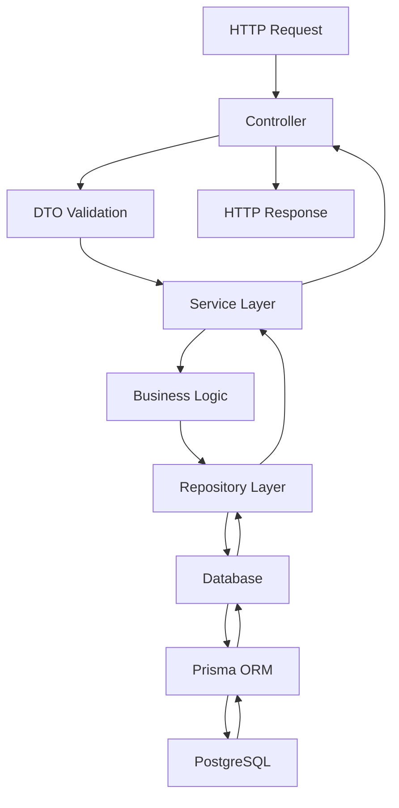

# API Architecture Documentation

## Overview

The Local Classifieds API follows a modular, layered architecture that promotes separation of concerns, testability, and maintainability. This document outlines the architectural patterns and design decisions.

## 🏗️ Architecture Layers

### 1. Controller Layer

**Responsibility**: Handle HTTP requests and responses

```typescript
@Controller('categories')
export class CategoriesController {
  @Post()
  async create(@Body() createCategoryDto: CreateCategoryDto) {
    return this.categoriesService.create(createCategoryDto);
  }
}
```

**Key Features**:

- HTTP request/response handling
- Input validation using DTOs
- Error handling and status codes
- Authentication and authorization

### 2. Service Layer

**Responsibility**: Business logic and orchestration

```typescript
@Injectable()
export class CategoriesService {
  async create(data: CreateCategoryData): Promise<Category> {
    // Business logic
    const validation = await this.validateHierarchy(data.parentId, null);
    if (!validation.isValid) {
      throw new Error(`Invalid hierarchy: ${validation.error}`);
    }

    return this.categoryRepository.create(data);
  }
}
```

**Key Features**:

- Business rule enforcement
- Data validation and transformation
- Orchestration of multiple repositories
- Transaction management

### 3. Repository Layer

**Responsibility**: Data access abstraction

```typescript
@Injectable()
export class CategoryRepository {
  async findById(id: string): Promise<Category | null> {
    return this.prisma.category.findUnique({ where: { id } });
  }
}
```

**Key Features**:

- Database query abstraction
- Prisma ORM integration
- Query optimization
- Data mapping

### 4. Database Layer

**Responsibility**: Data persistence

```typescript
@Injectable()
export class PrismaService extends PrismaClient {
  async onModuleInit() {
    await this.$connect();
  }
}
```

**Key Features**:

- Database connection management
- Migration handling
- Connection pooling
- Health checks

## 📁 Directory Structure

```
src/
├── modules/                    # Feature modules
│   └── categories/            # Categories domain
│       ├── categories.controller.ts    # HTTP layer
│       ├── categories.service.ts       # Business logic
│       ├── categories.module.ts        # Module definition
│       ├── dto/                        # Data Transfer Objects
│       │   ├── create-category.dto.ts
│       │   ├── update-category.dto.ts
│       │   └── category-query.dto.ts
│       ├── entities/                   # Domain entities
│       │   └── category.entity.ts
│       └── __tests__/                  # Unit tests
│           ├── categories.controller.spec.ts
│           └── categories.service.spec.ts
├── database/                  # Data access layer
│   └── repositories/          # Repository implementations
│       └── category.repository.ts
├── common/                    # Cross-cutting concerns
│   ├── guards/               # Authentication guards
│   ├── filters/              # Exception filters
│   ├── interceptors/         # Request/response interceptors
│   ├── decorators/           # Custom decorators
│   └── pipes/                # Validation pipes
├── config/                   # Configuration management
│   ├── app.config.ts         # Application settings
│   ├── database.config.ts    # Database settings
│   └── validation.config.ts  # Environment validation
└── libs/                     # Internal libraries
    ├── database/             # Database infrastructure
    │   ├── prisma.service.ts
    │   ├── database.module.ts
    │   └── types.ts
    └── shared/               # Shared utilities
        ├── dto/              # Common DTOs
        ├── types/            # Shared types
        └── utils/            # Utility functions
```

## 🔄 Data Flow



## 🎯 Design Patterns

### 1. Repository Pattern

**Purpose**: Abstract data access logic

```typescript
// Interface
interface CategoryRepository {
  findById(id: string): Promise<Category | null>;
  create(data: CreateCategoryData): Promise<Category>;
  update(id: string, data: UpdateCategoryData): Promise<Category>;
}

// Implementation
@Injectable()
export class CategoryRepository implements CategoryRepository {
  constructor(private prisma: PrismaService) {}

  async findById(id: string): Promise<Category | null> {
    return this.prisma.category.findUnique({ where: { id } });
  }
}
```

### 2. Dependency Injection

**Purpose**: Loose coupling and testability

```typescript
@Injectable()
export class CategoriesService {
  constructor(
    private categoryRepository: CategoryRepository,
    private prisma: PrismaService
  ) {}
}
```

### 3. DTO Pattern

**Purpose**: Type-safe data transfer

```typescript
export const CreateCategorySchema = z.object({
  slug: z.string().min(1).max(140),
  translations: z.array(CategoryTranslationSchema).min(1),
});

export type CreateCategoryDto = z.infer<typeof CreateCategorySchema>;
```

### 4. Module Pattern

**Purpose**: Feature organization and encapsulation

```typescript
@Module({
  imports: [DatabaseModule],
  controllers: [CategoriesController],
  providers: [CategoriesService, CategoryRepository],
  exports: [CategoriesService],
})
export class CategoriesModule {}
```

## 🛡️ Security Considerations

### 1. Input Validation

- All inputs validated using Zod schemas
- SQL injection prevention through Prisma ORM
- XSS protection through input sanitization

### 2. Authentication & Authorization

- JWT token-based authentication (future)
- Role-based access control (future)
- API rate limiting (future)

### 3. Error Handling

- Global exception filters
- Sanitized error messages
- Proper HTTP status codes

## 🧪 Testing Strategy

### 1. Unit Tests

- Service layer business logic
- Repository data access methods
- Utility functions

### 2. Integration Tests

- Controller endpoints
- Database operations
- Module integration

### 3. E2E Tests

- Complete user workflows
- API contract validation
- Performance testing

## 📊 Performance Considerations

### 1. Database Optimization

- Connection pooling
- Query optimization
- Indexing strategy
- Pagination for large datasets

### 2. Caching Strategy

- Redis for session storage (future)
- Query result caching (future)
- CDN for static assets (future)

### 3. Monitoring

- Health check endpoints
- Performance metrics
- Error tracking
- Log aggregation

## 🔧 Configuration Management

### 1. Environment Variables

```typescript
export const env = validateEnv(); // Zod validation
```

### 2. Feature Flags

```typescript
export const featureFlags = {
  enableNewFeature: process.env.ENABLE_NEW_FEATURE === 'true',
};
```

### 3. Database Configuration

```typescript
export const databaseConfig = {
  url: process.env.DATABASE_URL,
  maxConnections: parseInt(process.env.DATABASE_MAX_CONNECTIONS || '10', 10),
};
```

## 🚀 Scalability Considerations

### 1. Horizontal Scaling

- Stateless service design
- Load balancer compatibility
- Database read replicas (future)

### 2. Microservices Migration

- Module-based architecture
- Clear service boundaries
- Event-driven communication (future)

### 3. Performance Monitoring

- APM integration (future)
- Custom metrics collection
- Alerting and notifications

## 📝 Best Practices

### 1. Code Organization

- Single responsibility principle
- Dependency inversion
- Interface segregation

### 2. Error Handling

- Consistent error responses
- Proper logging
- Graceful degradation

### 3. Documentation

- API documentation with OpenAPI
- Code comments for complex logic
- Architecture decision records

## 🔄 Future Enhancements

### 1. Authentication System

- JWT-based authentication
- OAuth2 integration
- Multi-factor authentication

### 2. Advanced Features

- Real-time notifications
- File upload handling
- Search and filtering

### 3. DevOps Integration

- CI/CD pipelines
- Container orchestration
- Infrastructure as code

---

This architecture provides a solid foundation for building scalable, maintainable APIs while following industry best practices and design patterns.
