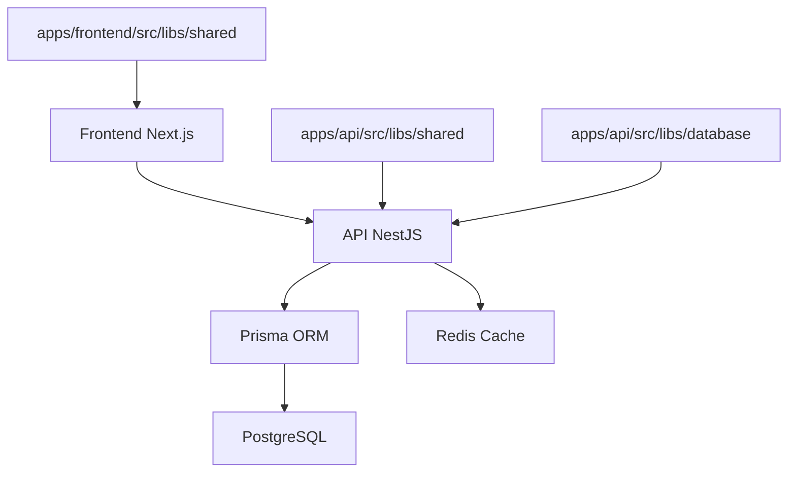

# Project Architecture

## Overview

Local Classifieds is a monorepo that uses a modern architecture with clear separation of responsibilities between frontend, backend, and data layer.

## Technology Stack

### Backend (apps/api)

- **Framework**: NestJS
- **Linguagem**: TypeScript
- **ORM**: Prisma
- **Validation**: Zod
- **Testes**: Jest

### Frontend (apps/frontend)

- **Framework**: Next.js 14
- **Linguagem**: TypeScript
- **Styling**: TailwindCSS
- **Validation**: Zod (internal library)

### Database

- **SGBD**: PostgreSQL 15
- **ORM**: Prisma
- **Cache**: Redis 7

## Data Models

### Category Model

The Category model represents service categories with hierarchical support and soft delete functionality.

#### Schema Structure

```typescript
model Category {
  id            String     @id @default(uuid()) @db.Uuid
  name          String     @db.VarChar(120)
  slug          String     @unique @db.VarChar(140)
  description   String?    @db.Text
  parentId      String?    @db.Uuid
  parent        Category?  @relation("CategoryHierarchy", fields: [parentId], references: [id], onUpdate: Cascade, onDelete: SetNull)
  children      Category[] @relation("CategoryHierarchy")
  active        Boolean    @default(true)
  displayOrder  Int        @default(0)
  createdAt     DateTime   @default(now()) @db.Timestamptz(6)
  updatedAt     DateTime   @default(now()) @updatedAt @db.Timestamptz(6)

  @@map("categories")
}
```

#### Key Features

- **Hierarchical Structure**: Self-referencing relationship for parent-child categories
- **Soft Delete**: Uses `active` boolean field instead of physical deletion
- **Unique Slugs**: URL-friendly identifiers for categories
- **Display Ordering**: Configurable ordering for UI presentation
- **Cycle Prevention**: Business logic prevents circular references

#### Database Constraints

- Primary Key: `id` (UUID)
- Unique Index: `slug` for fast lookups
- Foreign Key: `parentId` references `categories(id)`
- Indexes: `parentId`, `active` for performance

#### Business Rules

1. **Slug Uniqueness**: Each category must have a unique slug
2. **Hierarchy Validation**: Categories cannot be their own parent or create cycles
3. **Soft Delete**: Categories with active children cannot be deleted
4. **Slug Generation**: Automatic generation from name (lowercase, no accents, hyphens for spaces)

### Infraestrutura

- **Containerização**: Docker & Docker Compose
- **CI/CD**: GitHub Actions
- **Gerenciamento de Pacotes**: npm workspaces

## Project Structure

```
/
├── apps/                    # Aplicações principais
│   ├── api/                # Backend NestJS
│   │   ├── src/
│   │   │   ├── libs/       # Bibliotecas internas
│   │   │   │   ├── database/ # Camada de dados
│   │   │   │   └── shared/  # Utilitários compartilhados
│   │   │   ├── modules/    # Módulos da aplicação
│   │   │   ├── controllers/
│   │   │   ├── services/
│   │   │   └── main.ts
│   │   ├── prisma/         # Schema e migrações
│   │   └── package.json
│   └── frontend/           # Frontend Next.js
│       ├── src/
│       │   ├── libs/       # Bibliotecas internas
│       │   │   └── shared/  # Utilitários compartilhados
│       │   ├── app/        # App Router (Next.js 13+)
│       │   ├── components/
│       │   └── lib/
│       └── package.json
├── docs/                   # Documentação
├── .github/                # GitHub Actions
└── docker-compose.yml      # Serviços de desenvolvimento
```

## Data Flow



## Development Patterns

### 1. Monorepo with Workspaces

- Cada aplicação e biblioteca tem seu próprio `package.json`
- Dependências compartilhadas são gerenciadas no root
- Scripts centralizados para facilitar o desenvolvimento

### 2. Internal Libraries

- Tipos TypeScript definidos em `apps/*/src/libs/shared`
- DTOs com validação Zod reutilizados dentro de cada aplicação
- Interfaces consistentes em cada aplicação
- Cada projeto mantém suas próprias bibliotecas

### 3. Data Layer

- Prisma como ORM principal
- Schema centralizado em `apps/api/prisma`
- Migrações versionadas
- Cliente Prisma gerado automaticamente

### 4. Data Validation

- Zod para validação runtime
- DTOs tipados e validados
- Mensagens de erro consistentes

## Development Configuration

### Environment Variables

- `.env` para cada aplicação
- `env.example` como template
- Secrets gerenciados via GitHub

### Docker for Development

- PostgreSQL e Redis via Docker Compose
- Volumes persistentes para dados
- Health checks configurados

### Hot Reload

- Backend: NestJS com `--watch`
- Frontend: Next.js com Fast Refresh
- Internal libraries: TypeScript com `--watch`

## Deploy and Production

### CI/CD Pipeline

1. **CI**: Testes, lint e build em PRs
2. **Deploy**: Deploy automático em push para main
3. **Migrations**: Executadas automaticamente no deploy

### Deploy Strategy

- Backend: Container ou serverless
- Frontend: CDN (Vercel, Netlify)
- Database: PostgreSQL gerenciado
- Cache: Redis gerenciado

## Security

### Authentication (Futuro)

- JWT tokens
- Refresh tokens
- Middleware de autenticação

### Validation

- Input validation com Zod
- Sanitização de dados
- Rate limiting

### CORS

- Configuração específica por ambiente
- Headers de segurança

## Monitoring

### Logs

- Estruturados com contexto
- Diferentes níveis (debug, info, warn, error)
- Correlação de requests

### Métricas

- Health checks
- Performance monitoring
- Error tracking

## Scalability

### Backend

- Stateless design
- Connection pooling
- Caching strategies

### Frontend

- Static generation onde possível
- Image optimization
- Code splitting

### Database

- Índices otimizados
- Query optimization
- Read replicas (futuro)
