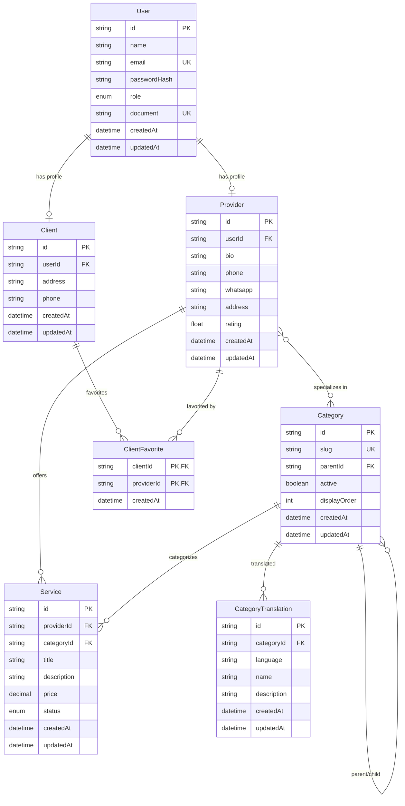

# Database Schema Documentation

## Overview

Este documento descreve a estrutura completa do banco de dados do sistema de classificados locais, incluindo todas as entidades, relacionamentos, índices e regras de negócio.

## Entity Relationship Diagram (DER)



## Database Tables

### 1. Users Table

**Purpose**: Armazena informações básicas dos usuários do sistema.

| Column         | Type           | Constraints                 | Description                                |
| -------------- | -------------- | --------------------------- | ------------------------------------------ |
| `id`           | UUID           | PRIMARY KEY, DEFAULT uuid() | Identificador único do usuário             |
| `name`         | VARCHAR(120)   | NOT NULL                    | Nome completo do usuário                   |
| `email`        | VARCHAR(140)   | UNIQUE, NOT NULL            | Email único para login                     |
| `passwordHash` | VARCHAR(255)   | NOT NULL                    | Hash da senha (bcrypt)                     |
| `role`         | ENUM           | DEFAULT 'CLIENT'            | Papel do usuário (CLIENT, PROVIDER, ADMIN) |
| `document`     | VARCHAR(20)    | UNIQUE, NULLABLE            | CPF/CNPJ (opcional)                        |
| `createdAt`    | TIMESTAMPTZ(6) | DEFAULT now()               | Data de criação                            |
| `updatedAt`    | TIMESTAMPTZ(6) | DEFAULT now(), ON UPDATE    | Data da última atualização                 |

**Indexes**:

- `idx_users_email` (email)
- `idx_users_document` (document)

### 2. Providers Table

**Purpose**: Perfil detalhado dos prestadores de serviço.

| Column      | Type           | Constraints                 | Description                     |
| ----------- | -------------- | --------------------------- | ------------------------------- |
| `id`        | UUID           | PRIMARY KEY, DEFAULT uuid() | Identificador único do provider |
| `userId`    | UUID           | UNIQUE, FOREIGN KEY         | Referência ao usuário           |
| `bio`       | TEXT           | NULLABLE                    | Biografia/descrição do provider |
| `phone`     | VARCHAR(30)    | NULLABLE                    | Telefone de contato             |
| `whatsapp`  | VARCHAR(30)    | NULLABLE                    | WhatsApp de contato             |
| `address`   | VARCHAR(255)   | NULLABLE                    | Endereço do provider            |
| `rating`    | FLOAT          | DEFAULT 0                   | Avaliação média (0-5)           |
| `createdAt` | TIMESTAMPTZ(6) | DEFAULT now()               | Data de criação                 |
| `updatedAt` | TIMESTAMPTZ(6) | DEFAULT now(), ON UPDATE    | Data da última atualização      |

**Indexes**:

- `idx_providers_user_id` (userId)
- `idx_providers_rating` (rating)

### 3. Clients Table

**Purpose**: Perfil dos clientes que contratam serviços.

| Column      | Type           | Constraints                 | Description                    |
| ----------- | -------------- | --------------------------- | ------------------------------ |
| `id`        | UUID           | PRIMARY KEY, DEFAULT uuid() | Identificador único do cliente |
| `userId`    | UUID           | UNIQUE, FOREIGN KEY         | Referência ao usuário          |
| `address`   | VARCHAR(255)   | NULLABLE                    | Endereço do cliente            |
| `phone`     | VARCHAR(30)    | NULLABLE                    | Telefone de contato            |
| `createdAt` | TIMESTAMPTZ(6) | DEFAULT now()               | Data de criação                |
| `updatedAt` | TIMESTAMPTZ(6) | DEFAULT now(), ON UPDATE    | Data da última atualização     |

**Indexes**:

- `idx_clients_user_id` (userId)

### 4. Services Table

**Purpose**: Serviços oferecidos pelos providers.

| Column        | Type           | Constraints                 | Description                    |
| ------------- | -------------- | --------------------------- | ------------------------------ |
| `id`          | UUID           | PRIMARY KEY, DEFAULT uuid() | Identificador único do serviço |
| `providerId`  | UUID           | FOREIGN KEY                 | Referência ao provider         |
| `categoryId`  | UUID           | FOREIGN KEY                 | Referência à categoria         |
| `title`       | VARCHAR(140)   | NOT NULL                    | Título do serviço              |
| `description` | TEXT           | NULLABLE                    | Descrição detalhada            |
| `price`       | DECIMAL(10,2)  | NULLABLE                    | Preço do serviço               |
| `status`      | ENUM           | DEFAULT 'ACTIVE'            | Status (ACTIVE, INACTIVE)      |
| `createdAt`   | TIMESTAMPTZ(6) | DEFAULT now()               | Data de criação                |
| `updatedAt`   | TIMESTAMPTZ(6) | DEFAULT now(), ON UPDATE    | Data da última atualização     |

**Indexes**:

- `idx_services_provider_id` (providerId)
- `idx_services_category_id` (categoryId)
- `idx_services_status` (status)
- `idx_services_price` (price)

### 5. Categories Table

**Purpose**: Categorias hierárquicas de serviços.

| Column         | Type           | Constraints                 | Description                      |
| -------------- | -------------- | --------------------------- | -------------------------------- |
| `id`           | UUID           | PRIMARY KEY, DEFAULT uuid() | Identificador único da categoria |
| `slug`         | VARCHAR(140)   | UNIQUE, NOT NULL            | Slug para URLs                   |
| `parentId`     | UUID           | FOREIGN KEY, NULLABLE       | Categoria pai (hierarquia)       |
| `active`       | BOOLEAN        | DEFAULT true                | Se a categoria está ativa        |
| `displayOrder` | INTEGER        | DEFAULT 0                   | Ordem de exibição                |
| `createdAt`    | TIMESTAMPTZ(6) | DEFAULT now()               | Data de criação                  |
| `updatedAt`    | TIMESTAMPTZ(6) | DEFAULT now(), ON UPDATE    | Data da última atualização       |

**Indexes**:

- `idx_categories_slug` (slug)
- `idx_categories_parent_id_active` (parentId, active)
- `idx_categories_active_display_order` (active, displayOrder)

### 6. CategoryTranslations Table

**Purpose**: Traduções das categorias em diferentes idiomas.

| Column        | Type           | Constraints                 | Description                           |
| ------------- | -------------- | --------------------------- | ------------------------------------- |
| `id`          | UUID           | PRIMARY KEY, DEFAULT uuid() | Identificador único da tradução       |
| `categoryId`  | UUID           | FOREIGN KEY                 | Referência à categoria                |
| `language`    | VARCHAR(5)     | NOT NULL                    | Código do idioma (pt-BR, en-US, etc.) |
| `name`        | VARCHAR(120)   | NOT NULL                    | Nome traduzido                        |
| `description` | TEXT           | NULLABLE                    | Descrição traduzida                   |
| `createdAt`   | TIMESTAMPTZ(6) | DEFAULT now()               | Data de criação                       |
| `updatedAt`   | TIMESTAMPTZ(6) | DEFAULT now(), ON UPDATE    | Data da última atualização            |

**Indexes**:

- `idx_category_translations_category_language` (categoryId, language) - UNIQUE
- `idx_category_translations_language` (language)

### 7. ClientFavorites Table

**Purpose**: Relacionamento many-to-many entre clientes e providers favoritos.

| Column       | Type           | Constraints              | Description                |
| ------------ | -------------- | ------------------------ | -------------------------- |
| `clientId`   | UUID           | PRIMARY KEY, FOREIGN KEY | Referência ao cliente      |
| `providerId` | UUID           | PRIMARY KEY, FOREIGN KEY | Referência ao provider     |
| `createdAt`  | TIMESTAMPTZ(6) | DEFAULT now()            | Data em que foi favoritado |

**Indexes**:

- `idx_client_favorites_client_id` (clientId)
- `idx_client_favorites_provider_id` (providerId)
- `idx_client_favorites_created_at` (createdAt)

## Enums

### UserRole

```sql
CREATE TYPE "UserRole" AS ENUM ('CLIENT', 'PROVIDER', 'ADMIN');
```

### ServiceStatus

```sql
CREATE TYPE "ServiceStatus" AS ENUM ('ACTIVE', 'INACTIVE');
```

## Relationships

### One-to-One Relationships

- `User` ↔ `Provider` (1:1) - Um usuário pode ter no máximo um perfil de provider
- `User` ↔ `Client` (1:1) - Um usuário pode ter no máximo um perfil de cliente

### One-to-Many Relationships

- `User` → `Provider` (1:1) - Um usuário tem um provider
- `User` → `Client` (1:1) - Um usuário tem um cliente
- `Provider` → `Service` (1:N) - Um provider oferece vários serviços
- `Category` → `Service` (1:N) - Uma categoria contém vários serviços
- `Category` → `Category` (1:N) - Hierarquia de categorias (parent/child)
- `Category` → `CategoryTranslation` (1:N) - Uma categoria tem várias traduções

### Many-to-Many Relationships

- `Provider` ↔ `Category` (N:N) - Providers podem se especializar em várias categorias
- `Client` ↔ `Provider` (N:N) - Clientes podem favoritar vários providers (via ClientFavorites)

## Business Rules

### 1. User Management

- Um usuário pode ter apenas um perfil (Provider OU Client)
- Email deve ser único em todo o sistema
- Document (CPF/CNPJ) deve ser único quando preenchido

### 2. Category Management

- Categorias podem ter hierarquia (parent/child)
- Slug deve ser único
- Categorias inativas não devem aparecer em listagens públicas
- Ordem de exibição é controlada pelo campo `displayOrder`

### 3. Service Management

- Serviços devem estar associados a um provider e uma categoria
- Preço é opcional (pode ser "sob consulta")
- Status controla visibilidade pública

### 4. Favorites Management

- Cliente não pode favoritar o mesmo provider duas vezes
- Relacionamento é controlado por chave primária composta

### 5. Translation Management

- Cada categoria deve ter pelo menos uma tradução
- Idioma deve seguir padrão ISO (pt-BR, en-US, pt-PT)
- Nome é obrigatório, descrição é opcional

## Performance Considerations

### Indexes Strategy

1. **Primary Keys**: Todos os IDs são UUIDs com índices automáticos
2. **Foreign Keys**: Todos os FKs têm índices para joins eficientes
3. **Unique Constraints**: Email, document, slug têm índices únicos
4. **Composite Indexes**:
   - `(parentId, active)` para listagem de categorias ativas por grupo
   - `(active, displayOrder)` para ordenação de categorias ativas
   - `(categoryId, language)` para traduções únicas

### Query Optimization

- Use `active = true` em consultas públicas
- Ordene por `displayOrder` para categorias
- Use `LIMIT/OFFSET` para paginação
- Filtre por `status = 'ACTIVE'` para serviços públicos

## Migration History

1. **20250926225645_create_categories** - Criação inicial das categorias
2. **20250926230000_add_category_translations** - Adição de traduções
3. **20250928131447_add_category_performance_indexes** - Índices de performance
4. **20250928173944_add_user_provider_client_service_models** - Modelos principais
5. **20250928174614_improve_schema_with_favorites_and_fixes** - Melhorias e favoritos

## Future Considerations

### Soft Delete

- Considerar adicionar `deletedAt` para histórico
- Implementar em User, Provider, Client, Service, Category

### Audit Trail

- Adicionar campos `createdBy`, `updatedBy` para auditoria
- Implementar triggers para log de mudanças

### Caching Strategy

- Cache de categorias ativas (Redis)
- Cache de traduções por idioma
- Cache de providers populares

### Scaling Considerations

- Particionamento por região (se necessário)
- Read replicas para consultas públicas
- Archive de dados antigos
